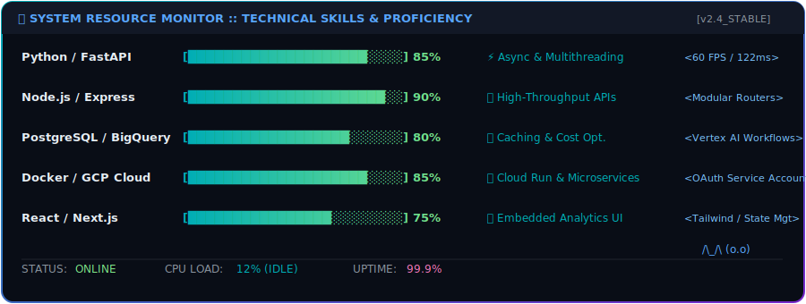

<div align="center">
  
</div>

<br />

<div align="center">
  <a href="https://vineetnotfound.vercel.app/"></a>
  <a href="https://www.linkedin.com/in/vineet-kushwaha-2666b5257/"></a>
  <a href="mailto:vineetkushwaha6325@gmail.com"></a>
</div>

<br />


### 👨‍💻 System Diagnostic & About Me

I am a **Backend-focused Software Engineer** based in Bengaluru, India. I specialize in designing modular backend systems, building high-throughput APIs, and orchestrating serverless data workflows. I love diving deep into performance tuning, optimizing latency, and solving complex system bottlenecks.

<br />

<div align="center">
  
</div>

<br />

* **🎓 Education:** B.E. in Computer Science & Engineering (Data Science) @ Acharya Institute of Technology (Graduating June 2026, CGPA: 8.7)
* **💡 Philosophy:** Write clean, modular, and self-documenting code. Optimize early where it matters (like reducing latency in real-time interfaces), and build architectures that scale.

<br />


### 🛠️ Technical Arsenal & Performance Stats

<div align="center">
  
</div>

<br />

<details>
<summary><b>🔍 Detailed Tech Stack Badges</b></summary>
<br />

| Category | Technologies |
| :--- | :--- |
| **Languages** |     |
| **Backend & APIs** |     |
| **Databases & Cloud** |      |
| **Tools & Frontend** |      |

</details>

<br />


### 🚀 Featured Projects

#### 🎶 [Real-Time Hand Gesture MIDI Synthesizer](https://github.com/shyamkrishnabnair/hand-gesture-recognition-mediapipe-main)
*A gesture-controlled performance synthesizer translating hand movements directly into MIDI events in real-time.*
* **Tech Stack:** `Python`, `MediaPipe`, `OpenCV`, `MIDI`, `Multithreading`
* **Performance Engineering:**
  * Avoided heavy, high-latency ML classification models. Engineered **custom hand landmark mathematics** to calculate distance/angles for 10 distinct gestures and pinch-to-drag controls.
  * Achieved **60 FPS** execution speed with an ultra-low latency of **~122ms** by implementing smart frame-skipping and running the audio synthesis engine on a dedicated CPU thread.
* **Key Features:** Real-time gesture-to-music translation, dynamic MIDI playback, pinch-based volume control, and custom live notation display.

#### 📊 SAC Commenting — Context-Aware Analytics Collaboration
*An enterprise-grade embedded collaboration system built to capture deep user context inside live analytics dashboards.*
* **Tech Stack:** `React.js`, `Express.js`, `BigQuery`, `Vertex AI (Gemini 2.5 Flash Lite)`
* **Architecture Highlights:**
  * Embedded directly into SAP Analytics Cloud dashboards, maintaining isolated page, filter, user, row, and cell-level state.
  * Designed and built the Express.js APIs and BigQuery backend schemas to secure data segregation and fast retrieval across corporate dashboard environments.
  * Integrated Vertex AI workflows for automated, context-aware comment summarization and rewriting.

#### 🎓 iConnect 2.0 — AI-Powered Enterprise Learning Platform
*A multi-service platform that automates learning path generation, semantic searches, and internal knowledge sharing.*
* **Tech Stack:** `React.js`, `Express.js`, `FastAPI`, `Google Cloud Run`, `BigQuery`
* **Optimization & Deployment:**
  * Owned the Express.js API gateway, establishing secure service-to-service communication on GCP Cloud Run using Google-authenticated service accounts.
  * **Saved AI compute costs & latency** by redesigning recommendation persistence: cached generated learning paths in BigQuery, preventing redundant LLM queries.
  * Integrated robust OAuth authorization and automated deployment pipelines.

<details>
<summary><b>🔍 View More Projects (Hackathons & Academic)</b></summary>
<br />

* 🔹 [**Endxiety**](https://github.com/vineet-k09/Endxiety) — AI-powered emotional support platform featuring real-time LLM chat, community chat rooms, and emotion tracking. *(React, OpenAI API, MongoDB, Vite)*
* 🔹 [**Saarthi AI**](https://github.com/vineet-k09/saarthi-ai) — Multilingual government scheme recommendation system featuring AI-driven voice and text assistance. *(React, TypeScript, ChatBase API)*
* 🔹 [**BiblioVerse**](https://github.com/vineet-k09/E-Book-Recommendation) — A distributed book recommendation system utilizing big data processing frameworks. *(Next.js, Node.js, MongoDB, Hadoop, PySpark)*
* 🔹 [**Bengaluru AI Road Guardian**](https://github.com/vineet-k09/potholeaAnalytics) — A civic-tech application for real-time pothole detection, automatic mapping, and municipal alerts. *(React, AI Image Classification, Map APIs)*
* 🔹 [**Portfolio Website**](https://vineetnotfound.vercel.app/) — Personal developer portfolio built with Next.js and Tailwind CSS. *(Legacy version available [here](https://vineet-k09.github.io/indexOLD.html))*

</details>

<br />


<div align="center">

### 📊 Contribution Matrix & Stats

<br />

<picture>
  <source media="(prefers-color-scheme: dark)" srcset="https://raw.githubusercontent.com/vineet-k09/vineet-k09/output/github-contribution-grid-snake-dark.svg">
  <source media="(prefers-color-scheme: light)" srcset="https://raw.githubusercontent.com/vineet-k09/vineet-k09/output/github-contribution-grid-snake.svg">
  
</picture> 

<br />

<sub><i>"Code is poetry. I'm just here to write a few symphonies in JavaScript & Python."</i></sub>

<br />

```text
  /\_/\
 ( o.o )   "Keep building. Stay curious."
  > ^ <
```

</div>
